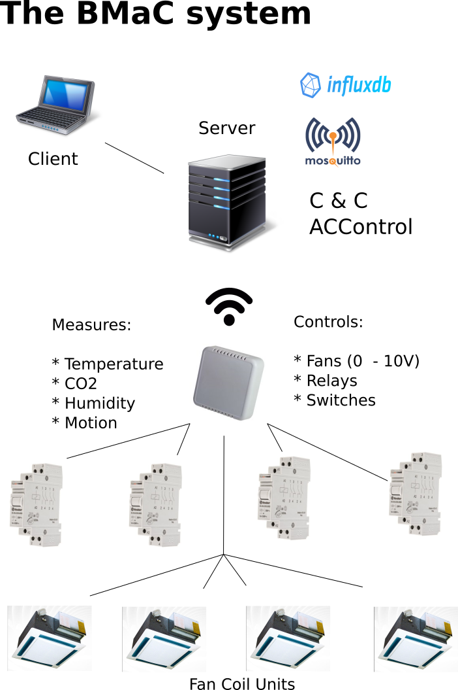

# Building Monitoring and Control 

**Author:** Maya Posch

**Last update:** 2017/12/19

## Introduction

The Building Monitoring and Control (**BMaC**) system consists out multiple components which all work together to allow one to monitor and control conditions within a building.

Communication between these components is performed over MQTT, requiring the use of an (existing) MQTT broker. An Influx database instance is used to register sensor data, allowing this data to be used by other services. An existing InfluxDB instance can be used, or a new one created for the BMaC system.

A graphical overview:

## Components

* Command & Control server
* Command & Control client
* Control & Monitoring node
* AC control service
* OTA update service
* Influx-MQTT service

### Command & Control server

This component (C&C server, or **CCS**) is used to register the configuration for individual nodes with. Each node can feature a different range of active sensors and actuators, which are enabled in the firmware at start-up of the node after they obtain their configuration from this server.

The C&C client is used to read out the current node configurations, update configurations and add new nodes.

### Command & Control client

This client (C&C client, or **CCC**) is based around a graphical user interface, which displays the map of the current building layout, along with the position of each node. By selecting a node, one can see its current configuration and update it.

After creating a new node or updating an existing one, the changed configuration can be saved on the C&C server or be sent directly to the node (useful for testing purposes).

### Control & Monitoring node

Also called **CMN**. In its current iteration these are ESP8266-based systems. Generally they are fitted into a wall- or ceiling-mounted enclosure using a custom board with the ability to mount temperature, CO2 and other sensors. They can also be in the form of a simple switch, in which case they are fitted into an electrical box, usually to replace a manual switch.

Each node runs the same firmware, yet can be configured via the CCS to only enable specific modules.

Current modules are:

* **Temperature/Humidity** - Uses the Bosch BME280 sensor to read temperature, humidity and air pressure.
* **CO2** - Uses the MH-Z19 and compatible (MH-Z14) CO2 sensor's serial interface to obtain PPM levels.
* **Jura** - Reads out current statistics on total number of coffee consumed for compatible Toptronic-based automatic coffee machines.
* **JuraTerm** - Allows for direct control of compatible Toptronic-based coffee machines using the serial protocol over MQTT.
* **Motion** - Uses compatible PIR motion sensors (e.g.  the HC-SR501) with 3.3V TTL output.
* **PWM** - Generates a PWM signal of variable duty, set to 1 KHz.
* **IO** - Uses the MCP23008 GPIO expander to increase the number of digital GPIO pins.
* **Switch** - Uses an external 2-coil latching relay to switch an input between two possible outputs and read the current setting back.

### AC control service

The AC control service (accontrol, or **ACCS**) builds upon the CCS, CMNs as well as the data stored in the Influx database in order to control the room temperature using installed Fan Coil Units (**FCUs**), along with the valves in the system (both 2- and 4-pipe FCUs).

It provides a HTTP REST API along with a simple browser-based interface using which one can set the target temperature for a particular node and read out the current temperature.

### OTA update service

The OTA update service (**OTAU**) works together with the CMN firmware to allow a CMN to update itself with a new firmware image. After the CMN receives an update trigger via its maintenance interface, it contacts a hard-coded HTTP URI to obtain the new firmware image.

The OTAU currently is a simple browser-based script using which CMNs can be added using their UID (MAC address) along with the name of the firmware image they should be downloading. When the CMN contacts the OTAU running inside a webserver, the OTAU selects the appropriate firmware image and sends it to the CMN.

### Influx-MQTT service

The Influx-MQTT service (**IMS**) can be configured to listen on a number of MQTT topics (sensor readings) and write those to a time series in the InfluxDB instance using its HTTP(S) line protocol.