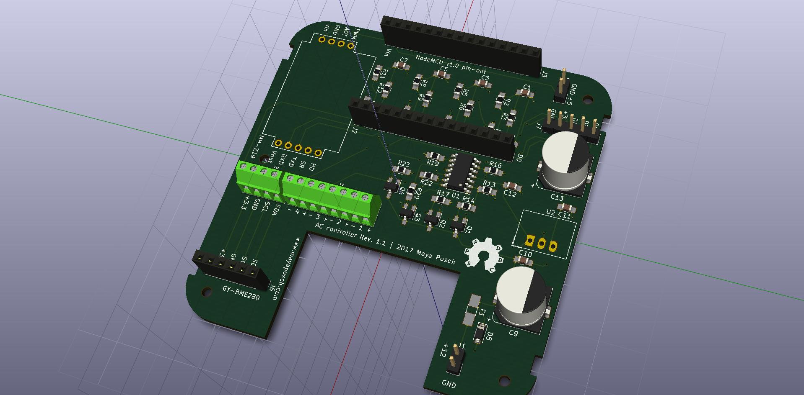

# Command & Control node

**Author:** Maya Posch

**Last Update:** 2018/02/27

## Introduction

Also called **CMN**. In its current iteration these are ESP8266-based systems. Generally they are fitted into a wall- or ceiling-mounted enclosure using a custom board with the ability to mount temperature, CO2 and other sensors. They can also be in the form of a simple switch, in which case they are fitted into an electrical box, usually to replace a manual switch.

Each node runs the same firmware, yet can be configured via the CCS to only enable specific modules.

Current modules are:

- **Temperature/Humidity** - Uses the Bosch BME280 sensor to read temperature, humidity and air pressure.
- **CO2** - Uses the MH-Z19 and compatible (MH-Z14) CO2 sensor's serial interface to obtain PPM levels.
- **Jura** - Reads out current statistics on total number of coffee consumed for compatible Toptronic-based automatic coffee machines.
- **JuraTerm** - Allows for direct control of compatible Toptronic-based coffee machines using the serial protocol over MQTT, terminal-style.
- **Motion** - Uses compatible PIR motion sensors (e.g.  the HC-SR501) with 3.3V TTL output.
- **PWM** - Generates a PWM signal of variable duty, set to 1 KHz.
- **IO** - Uses the MCP23008 GPIO expander to increase the number of digital GPIO pins.
- **Switch** - Uses an external 2-coil latching relay to switch an input between two possible outputs and read the current setting back.

## Building

This project is based on the Sming ESP8266 framework (https://github.com/SmingHub/Sming). As of writing the 3.4.0 release is recommend, with the latest commits to libemqtt & the MqttClient backported.

After following the installation instructions in the Sming wiki, one has to copy the two libraries in the `libs/` folder to the `$SMING_HOME/Libraries/` folder and (re)build Sming. This should finalise all dependencies for the project.

To configure the firmware, one has to set a few properties in the `Makefile-user.mk` file of the project before compiling it. These are the following settings:

* WiFi SSID
* WiFi password
* MQTT broker host address
* MQTT broker port (TLS/no TLS)
* MQTT username (if used)
* MQTT password (if used)
* OTA URL

These settings are then hardcoded into the firmware image during compilation. If one doesn't use TLS, one can then compile the project using Make and flash the resulting image as documented in the Sming wiki or use it as an OTA update image.

For TLS, one would compile both Sming and the project with the `ENABLE_SSL=1` option to Make. Note that in this case one has to add the client certificate and key to the `files/` folder in binary format (not Base64):

* files/**esp8266.client.crt.binary**
* files/**esp8266.client.key.binary**

These files will then be added to the filesystem on the firmware image.

**NOTE:** Due to the limited RAM on the ESP8266, it is required to set the SSL fragment size option on the TLS termination point (MQTT broker or proxy, e.g. HAProxy). A fragment size of about 2 kB is recommended. The default 16 kB size (for TX & RX) will cause the ESP8266 to run out of memory during handshake and reset.

## PCB KiCad project ##

The KiCad project for the controller's PCB is found in the `kicad/` folder. From these the Gerber files can be generated for the PCBs.

The PCB is designed for the CamdenBoss CBRS01VWH enclosure (wall/ceiling-mount).

More detailed information on this project can be found at: [https://hackaday.io/project/27548-wifi-ac-controller](https://hackaday.io/project/27548-wifi-ac-controller)